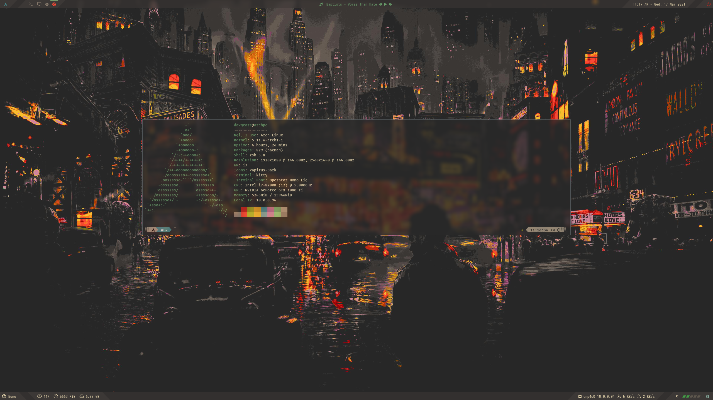
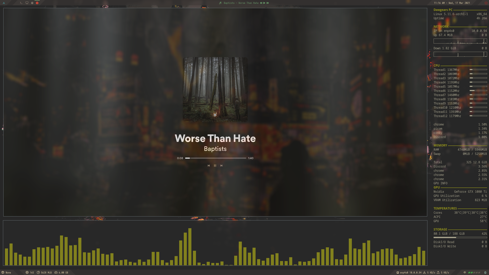
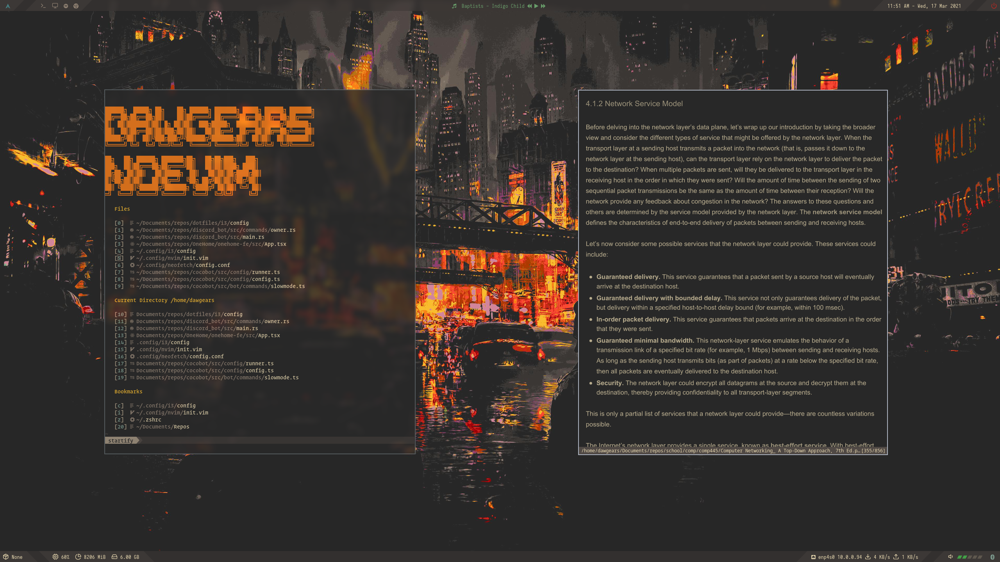
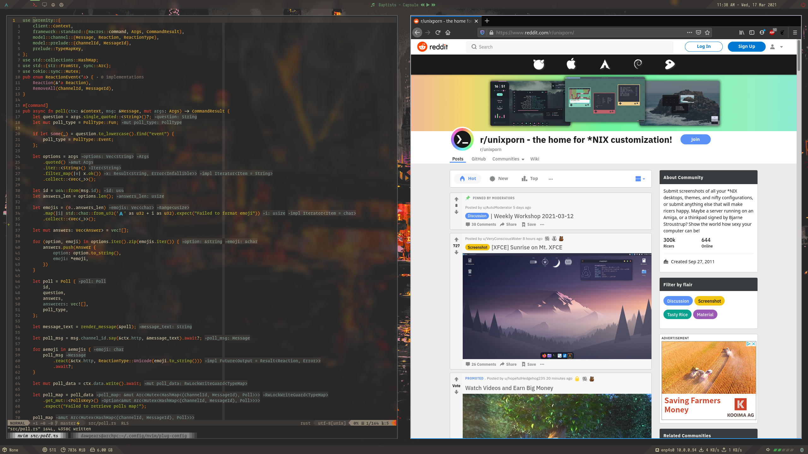

# My dotfiles as of 03/21 for Arch + i3-gaps setup 
### Posted this cause i was asked about my setup by a few friends, this is definitely still a WIP. Will update as I go!

Feel free to clone this repo! 

- Terminal : Kitty 
- Text Editor : NeoVim 
- WM : I3-gaps
- Bar : Polybar
- Shell : Zsh 
- Application Launcher: Rofi
- Document Viewer : Zathura
- Audio Visualizer : Cava 
- File Explorer : Ranger
- Activity Monitor : Gotop
- Resource Monitory : Conky 
- Music Player : Spicetify
- Calendar : Calcurse

### If you're using an arch based distro 
- Sudo pacman -S kitty i3-gaps zathura exa ranger spotifyd rofi tint2 neovim zsh feh xorg-xrandr conky flameshot

### you'll need Yay installed for the following ... 

- yay -S cava spicetify conky betterlockscreen gotop

   

