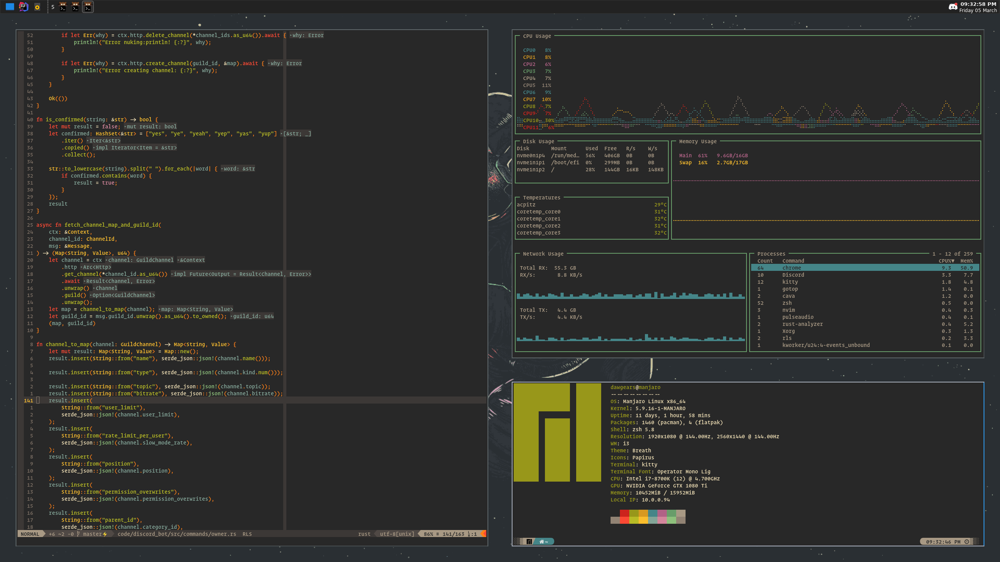
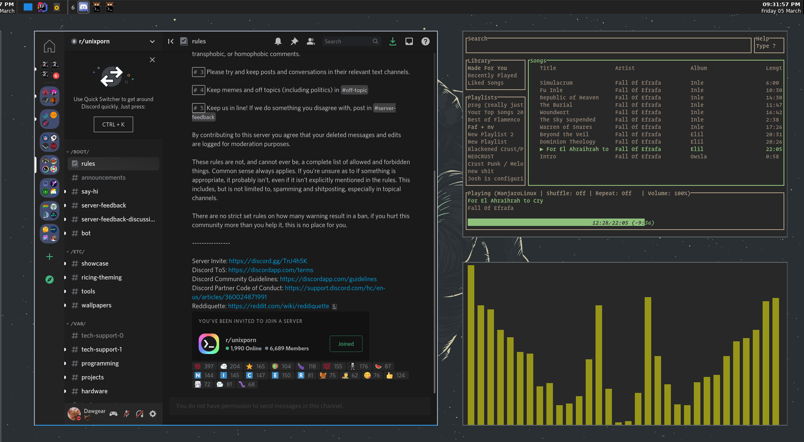
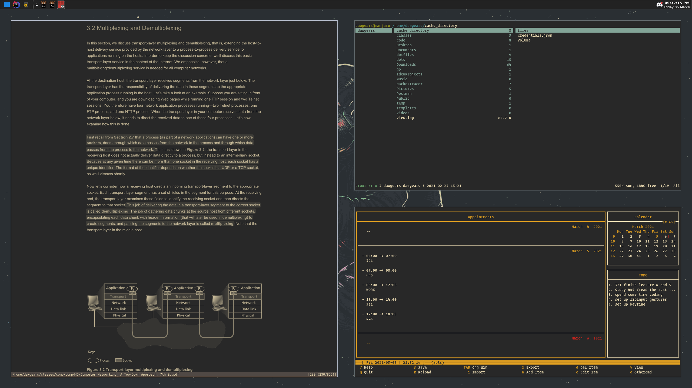

# My dotfiles as of 03/21 for Manjaro + i3-gaps setup 
### Posted this cause i was asked about my setup by a few friends, this is definitely still a WIP. Will update as I go!

Feel free to clone this repo! 

- Terminal : Kitty 
- Text Editor : NeoVim 
- WM : I3-gaps
- Bar : Tint2
- Shell : Zsh 
- Application Launcher: Rofi
- Document Viewer : Zathura
- Audio Visualizer : Cava 
- File Manager : Ranger
- Activity Monitor : Gotop 
- Music Player : Spotify-TUI
- Calendar : Calcurse

### If you're using an arch based distro 
- Sudo pacman -S kitty i3-gaps zathura  ranger spotifyd rofi tint2 neovim zsh feh xorg-xrandr  

### you'll need Yay installed for the following ... 

- yay -S cava spotify-tui i3lock-blur gotop

   

### Pictured: neovim (with some ugly rust), kitty, gotop

### Pictured: betterdiscord, spotify-tui, cava

### Pictured: zathura, calcurse, ranger

